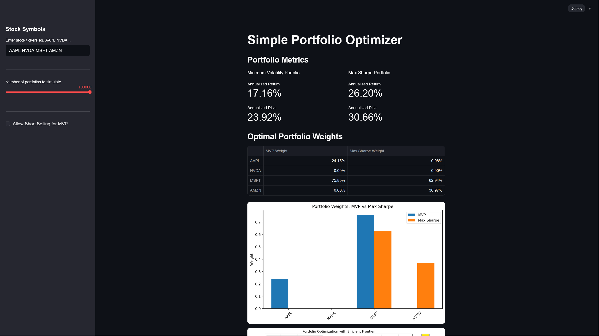
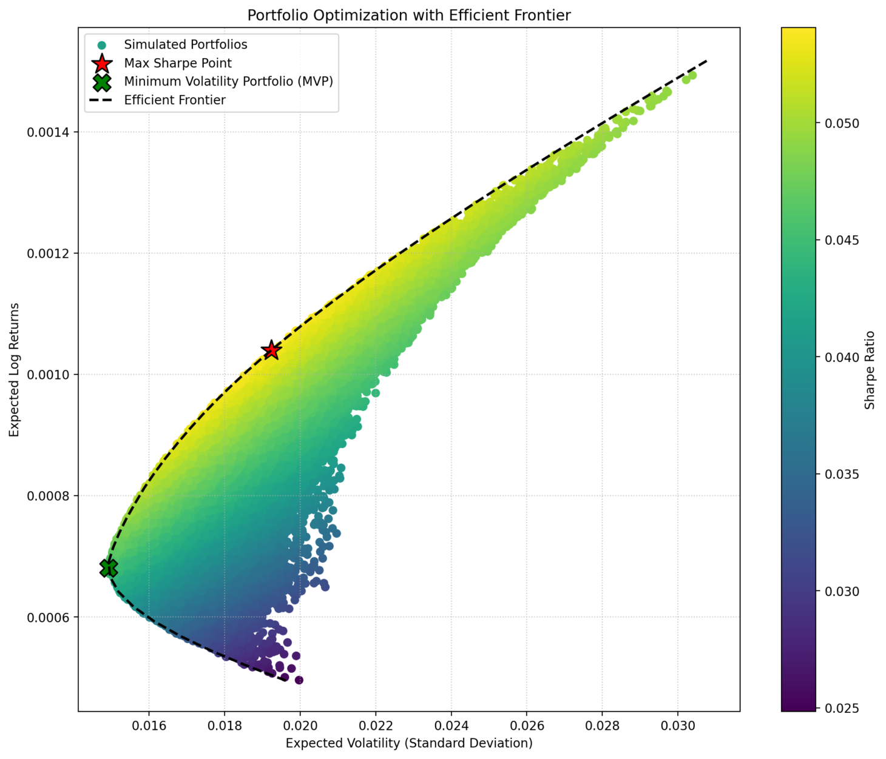
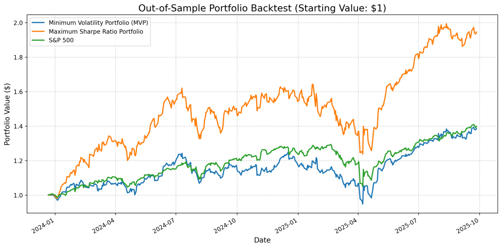

# 📊 Simple Portfolio Optimizer

A **Streamlit web app** for interactive portfolio optimization and backtesting, built in Python.  
This project demonstrates quantitative finance concepts (Minimum Variance Portfolio, Efficient Frontier, Sharpe Ratio maximization) with real stock data via the `yfinance` API.  

---

## 🚀 Features

- **Stock Data Integration**  
  - Pulls historical stock price data from Yahoo Finance (`yfinance`).  
  - Flexible ticker input (e.g., `AAPL NVDA MSFT`).  

- **Portfolio Optimization**  
  - Minimum Volatility Portfolio (MVP).  
  - Maximum Sharpe Ratio Portfolio.  
  - Efficient Frontier calculation.  
  - Short-selling toggle for MVP.  

- **Metrics Dashboard**  
  - Annualized return and risk.  
  - Optimal portfolio weights.

- **Visualization**  
  - Portfolio weight comparison (MVP vs Max Sharpe).  
  - Efficient Frontier with simulated portfolios.  
  - Highlighted MVP and Max Sharpe points.  

- **Backtesting**  
  - Out-of-sample performance test (starting at \$1).  
  - Compare MVP and Max Sharpe growth over time against market performance.  

---

## 📷 Demo

### Portfolio Metrics
- Annualized return & risk for MVP and Max Sharpe portfolios.  
- Optimal weights displayed in a formatted table.  
### Metrics
  

### Efficient Frontier
  

### Backtest
  

---

## ⚙️ Tech Stack

- **Languages**: Python  
- **Libraries**:  
  - `streamlit` – interactive UI  
  - `yfinance` – stock data retrieval  
  - `numpy`, `pandas` – data wrangling & math  
  - `scipy.optimize` – optimization routines  
  - `matplotlib`, `seaborn` – visualization  

---

## Usage
```streamlit run app.py```
